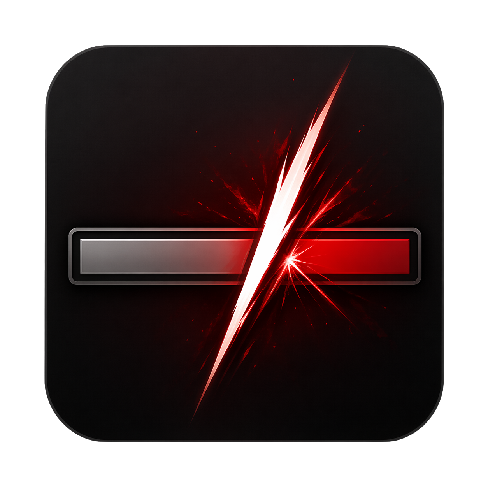

<p align="center">
  
</p>

<h1 align="center">LastHit (WORK IN PROGRESS)</h1>

---

## What it does

Monitors enemy HP during PvP. When the target's HP drops below the configured threshold, uses your job's PvP Limit Break. Good for classes like Ninja or Machinist to auto kill enemies.

## Features

- Configurable threshold, expressed as either a percent of max HP or an absolute HP value.
- Optional auto-target: picks the lowest-HP hostile in range when no manual target is set.
- Works for every PvP job.
- Status window: current target, HP / max HP / percent, threshold state, time since last fire.
- Respects the game's action availability and animation lock.

## Install

LastHit is distributed through a custom Dalamud plugin repository.

1. In-game, run `/xlsettings` → **Experimental**.
2. Under **Custom Plugin Repositories**, paste:
   ```
   https://raw.githubusercontent.com/XeldarAlz/FFXIV-LastHit/master/repo.json
   ```
   Tick **Enabled**, click the **+**, then **Save and Close**.
3. Open `/xlplugins` → **All Plugins**, search for **LastHit**, and install.

Updates are delivered automatically whenever a new release is cut.

## Commands

| Command | Action |
|---|---|
| `/lasthit` | Toggle the status window |
| `/lasthit config` | Open settings |

## Configuration

- **Enabled** — master switch.
- **Threshold mode** — percent of max HP, or absolute HP value.
- **Threshold value** — slider (percent) or numeric input (absolute).
- **Auto-select lowest-HP enemy** — used when no manual target is set.
- **Auto-select range** — yalms, 5–50.

## Job compatibility

PvP Limit Breaks are resolved dynamically from game data, so every job is wired up automatically. The table below tracks what has actually been verified in live PvP matches. If you test a job, please open an issue or PR so this list can be updated.

### Tanks
| Job | Status | Notes |
|---|---|---|
| Paladin | ❔ | Not tested yet |
| Warrior | ❔ | Not tested yet |
| Dark Knight | ❔ | Not tested yet |
| Gunbreaker | ❔ | Not tested yet |

### Healers
| Job | Status | Notes |
|---|---|---|
| White Mage | ❔ | Not tested yet |
| Scholar | ❔ | Not tested yet |
| Astrologian | ❔ | Not tested yet |
| Sage | ❔ | Not tested yet |

### Melee DPS
| Job | Status | Notes |
|---|---|---|
| Monk | ❔ | Not tested yet |
| Dragoon | ✅ | Confirmed working; multi-phase LB (High Jump → Sky Shatter) |
| Ninja | ✅ | Confirmed working |
| Samurai | ❔ | Not tested yet |
| Reaper | ❔ | Not tested yet |
| Viper | ❔ | Not tested yet |

### Physical Ranged DPS
| Job | Status | Notes |
|---|---|---|
| Bard | ❔ | Not tested yet |
| Machinist | ❔ | Not tested yet |
| Dancer | ❔ | Not tested yet |

### Magical Ranged DPS
| Job | Status | Notes |
|---|---|---|
| Black Mage | ❔ | Not tested yet |
| Summoner | ❔ | Not tested yet |
| Red Mage | ❔ | Not tested yet |
| Pictomancer | ❔ | Not tested yet |

## License

AGPL-3.0-or-later. See [LICENSE.md](LICENSE.md).
