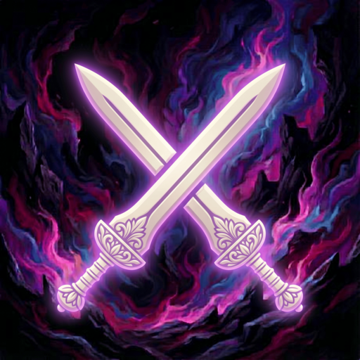

<p align="center">
  
</p>

<h1 align="center">PVP Auto LB</h1>

<p align="center">
  <a href="https://github.com/XeldarAlz/FFXIV-AutoPVPLimitBreak/releases/latest"></a>
  <a href="https://github.com/XeldarAlz/FFXIV-AutoPVPLimitBreak/releases"></a>
  <a href="https://github.com/XeldarAlz/FFXIV-AutoPVPLimitBreak/actions/workflows/release.yml"></a>
  <a href="LICENSE.md"></a>
</p>

<p align="center">
  <em>Auto-fires your PvP Limit Break at low-HP enemies. Built on Dalamud.</em>
</p>

---

<p align="center">
  
</p>

## What it does

Monitors enemy HP during PvP. When the target's HP drops below your configured threshold, fires your job's PvP Limit Break. Great for burst jobs like Ninja or Machinist to lock in kills.

Jobs whose PvP LB is defensive or support-focused (e.g. Paladin's Phalanx) are flagged in the status window and never auto-fired.

## Features

- **Configurable threshold**: percent of max HP or absolute HP, with per-job overrides.
- **Range- and shape-aware targeting**: single-target LBs respect cast range; circle-around-target LBs prefer clustered enemies; PBAoE LBs fire when any below-threshold enemy is in radius.
- **Shield-aware HP**: threshold checks against effective HP (`CurrentHp + ShieldHp`) so shields don't trigger early fires.
- **Skip doomed targets**: predicts time-to-death and skips enemies that will die before the LB lands.
- **Player blocklist + duty filter**: named players are never targeted; per-mode checkboxes (CC / Frontline / Rival Wings / Custom Match / Other) scope auto-fire.
- **Auto-target**: picks the lowest-effective-HP hostile in range; falls back to manual hard target when off.
- **Status window**: current target, HP bar with shield overlay and threshold marker, distance, range/shape, granular readiness (`READY` / `FIRING` / `PAUSED` / `OUT OF RANGE` / `GAUGE LOW` / `DEFENSIVE`).
- **Session + lifetime stats**: fires, attributed kills, total enemies hit. Lifetime persists across reloads.
- **Optional feedback**: chat sound (`/se1`–`/se16`) and/or chat line on fire.

## Install

In-game: `/xlsettings` → **Experimental** → paste into **Custom Plugin Repositories**:

```
https://raw.githubusercontent.com/XeldarAlz/DalamudPlugins/main/repo.json
```

Tick **Enabled**, click **+**, then **Save and Close**. Open `/xlplugins` → **All Plugins**, search for **PVP Auto LB**, and install.

## Commands

| Command | Action |
|---|---|
| `/pvpautolb` | Toggle the status window |
| `/palb` | Alias for `/pvpautolb` |
| `/pvpautolb config` | Open settings |

## Configuration

Open via `/pvpautolb config` or the gear icon in the status window.

- **Threshold**: mode (percent / absolute) and value. Below this, the LB fires.
- **Per-job override**: each job can have its own threshold mode and value.
- **Targeting**: auto-select toggle and scan radius (5–50 yalms). When off, only your hard target is considered.
- **Filters**: skip doomed targets, allowed duty types (CC / Frontline / Rival Wings / Custom / Other).
- **Player blocklist**: names listed here are never auto-targeted.
- **Feedback**: optional chat sound and/or chat line on fire.

## Job compatibility

Limit Breaks are resolved from game data, so every job is wired up automatically. The table tracks what has been verified in live PvP matches. If you test a job, please open an issue or PR.

**Legend:** ✅ confirmed · ❔ untested · 🛡 defensive/support: not auto-fired

| Tanks | Status | | Healers | Status |
|---|---|---|---|---|
| Paladin | 🛡 Phalanx | | White Mage | ✅ |
| Warrior | 🛡 Primal Scream | | Scholar | 🛡 Seraphism |
| Dark Knight | ✅ | | Astrologian | 🛡 Celestial River |
| Gunbreaker | ✅ | | Sage | 🛡 Mesotes |

| Melee DPS | Status | | Ranged DPS | Status |
|---|---|---|---|---|
| Monk | ✅ | | Bard | 🛡 Final Fantasia |
| Dragoon | ✅ | | Machinist | ✅ |
| Ninja | ✅ | | Dancer | 🛡 Contradance |
| Samurai | ✅ | | Black Mage | 🛡 Soul Resonance |
| Reaper | 🛡 Tenebrae Lemurum | | Summoner | 🛡 Phoenix & Bahamut |
| Viper | ✅ | | Red Mage | ✅ Southern Cross |
|  |  | | Pictomancer | 🛡 Advent of Chocobastion |

## License

AGPL-3.0-or-later. See [LICENSE.md](LICENSE.md).
